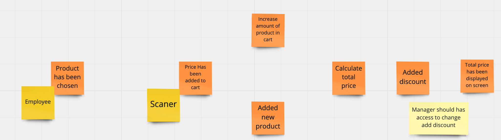
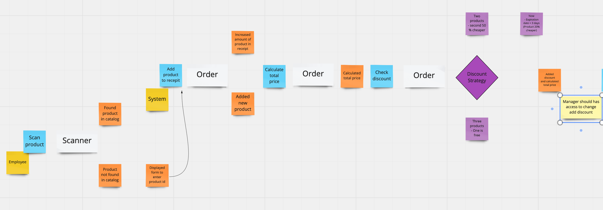
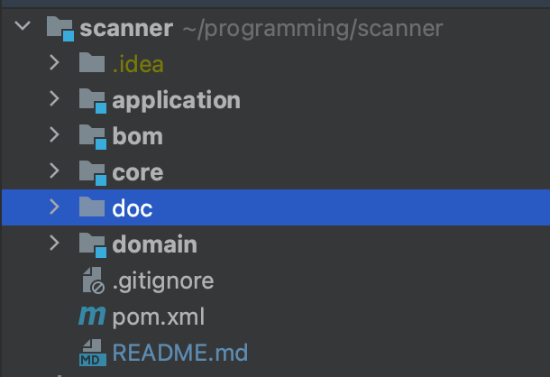
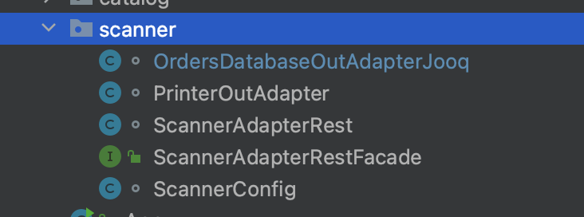
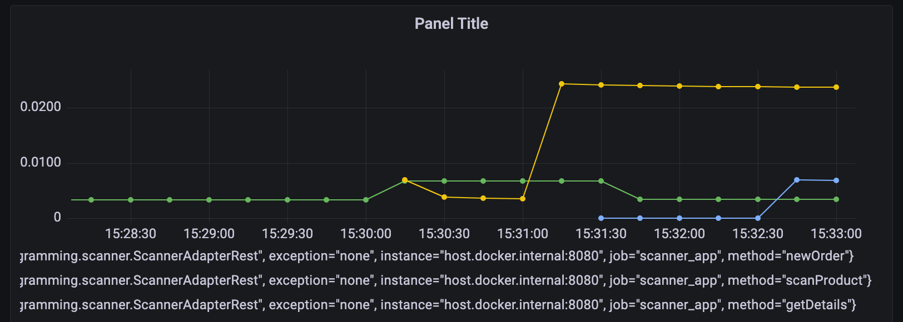

# My understanding of clean code.

## Domain

Simple application to scanning products and calculating price.

Gathering requirements - In the IT world we can see many technologies and techniques
to help gather business needs and transform them to software.
In this example I decided to use **Event storming** technique.

Below sample pictures from session:

1. First stage is **big picture** of business process,

   

2. The second stage is **process level event storming.**

   

## Architecture - DDD + Ports and adapters.

According to DDD, the heart of an application is domain. Models are not anemic and are not dependent on any frameworks.

Below structure of applications:




I’ve started implementation from a domain module based on event storming outcome. There are only domain classes which are used in other modules.

The core is a module responsible for properly handling user stories. In other words in most cases this kind of module should encapsulate logic of a program based on domain objects. In this module I discovered ports which are necessary to properly calculate prices and handle scanner logic.

The application is a pure infrastructure module which provides implementation of ports. In this example it is a simple rest api and database layer.


## Implementation 

Glue of the project is maven as a build system.

Good practice is to have a BOM file to manage dependencies versions, in this project this responsibility is taken by the bom module.

### 1. [Domain](https://github.com/Gert10987/scanner/tree/master/domain) - Java + Groovy + Spock + Lombok

Some nice things:

During implementation to avoid creating a lot of test data in different places, I used a pattern to do that in groovy in a more general way with default values.
 
```java
class ProductTestData {

    static Product sampleProduct(Map<String, Object> properties = [:]) {

        properties = SAMPLE_MAP + properties

        new Product(new Money(properties.price as String, properties.currency as Currency) as Money, properties.productType as ProductType, properties.expirationDate as LocalDate)
    }

    static Product prepareMilk(String price = "3.00") {
        sampleProduct(productType: ProductType.MILK, price: price)
    }

    static Product prepareLaptop(String price = "1000.0") {
        sampleProduct(productType: ProductType.LAPTOP, price: price)
    }

    static Map<String, Object> SAMPLE_MAP = [
            "price"         : "10.30",
            "currency"      : Currency.getInstance("PLN"),
            "productType"   : ProductType.LAPTOP,
            "expirationDate": LocalDate.now().plusDays(365)
    ]
}
```
and example of usage in **core**.

```groovy
 def 'should add milk to catalog'() {
        given:
        def milk = ProductTestData.prepareMilk()

        when:
        catalogService.add(milk)

        then:
        milk == catalogService.getByProductType(ProductType.MILK)
    }
```

Good exception handling by creating domain exceptions.

```java
public class CalculatingMoneyException extends DomainException {

    public static final DomainException AMOUNT_MONEY_SHOULD_BE_GREATER_THAN_0 = new CalculatingMoneyException("Amount of money should be greater than 0");
    public static final DomainException ONLY_PL_CURRENCY_IS_SUPPORTED = new CalculatingMoneyException("Only pl currency is supported");

    CalculatingMoneyException(String message) {
        super(message);
    }
}
```

[Core](https://github.com/Gert10987/scanner/tree/master/core) - Groovy + Spock + Lombok +  Fake implementations and mocking

Ports are on the package level

```java
interface OutPorts {

    interface PrinterPort {

        Optional<Billing> getBill(Order order);
    }

    interface OrdersDatabasePort {

        void add(Order order);

        Optional<Order> getById(OrderId id);

        void update(Order order);
    }
}
```
To test them at the core level, tests use fake implementations and mock to speed up implementation.

```java
static class TestCatalogDatabaseAdapter implements OutPorts.CatalogDatabasePort {

        private Map<ProductId, Product> products = [:]

        @Override
        void add(Product product) {
            products.put(product.getId(), product)
        }

        @Override
        Optional<Product> getById(ProductId productId) {
            return Optional.ofNullable(products.get(productId))
        }
        ....
```
Tests on this level (also in the application level) are written in clear way and can be read by **non technical people**

[Application](https://github.com/Gert10987/scanner/tree/master/application) - Java + Spring + Jooq + Groovy + Spock + TestContainers + ArchUnit

Infrastructure level of application (here are all configs and implementation of ports)

1. Database migration is handled by Flyway and can be invoke by
   ```shell
   mvn flyway:migrate -Dflyway.configFiles=db/flyway.conf
   ```
2. Packages are designed in facade way - only one class is achievable by other packages

   

3. Logging is based on Slf4j and uses MDC, because of that history of each request can be easily find

   ```shell
   8918 [http-nio-8080-exec-1]  INFO scanner - New order, [OrderId(id=7e95984d-537e-4c1d-be5d-0f8db008f2e3)] - request.id=bad418a2-d893-4f31-b6df-4f5030f69e3e - ip=127.0.0.1 
   ```
4. Metrics of application are collected via prometheus and can be found in grafana

    

6. Domain exceptions are transformed to HTTP statuses via filters
   ```java
   @ExceptionHandler(value = { ProductNotExistException.class })
    protected ResponseEntity<Object> handleConflict(ProductNotExistException ex, WebRequest request) {
        String bodyOfResponse = ex.getMessage();
        return handleExceptionInternal(ex, bodyOfResponse, new HttpHeaders(), HttpStatus.NOT_FOUND, request);
    }
   ```
6. To not adjusting model classes to db layer (which can be different in the future)
   The read model is based on records which are the same as model classes in the db adapter are mappers from db model to domain model.
   There was one problem with this approach: how to fill domain models without using business methods ?
   Solution is archUnit:
   Some of the domain classes have builders, but those builders can be used only in the db layer.

```java
@ArchTest
    void domainBuildersShouldBeInvokingOnlyDuringMapping(JavaClasses classes) {
        methods().that()
                .areDeclaredInClassesThat().resideInAnyPackage("..orders..", "..catalog..")
                .and()
                .haveName("builder")
                .should()
                .onlyBeCalled().byClassesThat().haveNameMatching(".*DatabaseOutAdapterJooq")
                .check(classes)
    }
 ```
7. Only integration tests in this module, based on webMvc and real postgresql db running in the test container.
 ```java
private class FakeClient implements ScannerAdapterRestFacade {


        private MvcResult lastResult

        @Override
        OrderId newOrder() {
            def response = mvc.perform(MockMvcRequestBuilders.post("/orders"))
                    .andReturn()
                    .response
                    .contentAsString

            new OrderId(UUID.fromString(JsonPath.read(response, '$.id')))
        }

        @Override
        void scanProduct(UUID id, String productType) {
            def res = mvc.perform(MockMvcRequestBuilders.patch("/orders/{id}", id)
                    .content(productType)
                    .contentType(MediaType.TEXT_PLAIN_VALUE))
                    .andReturn()

            lastResult = res

            if (res.response.status != 200) {
                throw res.getResolvedException()
            }
        }
   ...
 ```
8. Added some java docs.
9. Docker-compose file to run db, grafana, prometheus
   ```shell
   docker-compose up 
   docker-compose down -v  
   ```
10. Jooq as interface to db layer (To handle sql in more explicit way)
   ```java
@Override
    public Optional<Product> getById(ProductId productId) {
        return context.selectFrom(Tables.PRODUCTS)
                .where(Tables.PRODUCTS.ID.eq(productId.getId()))
                .fetchOptional()
                .map(this::toDomainObject);
    }
   ```

It is only a demo project to show tips, tricks and good practices :)


